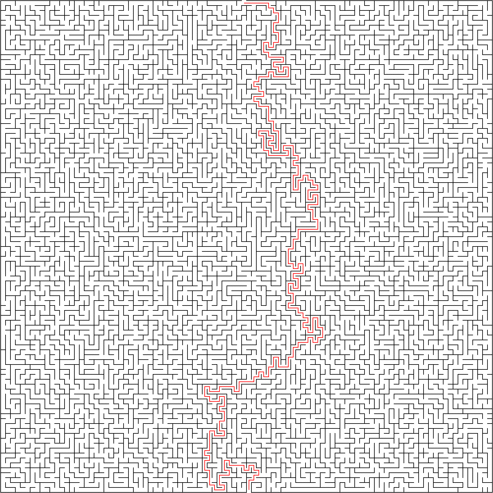

## Learning is the key

&nbsp;&nbsp;This is my `Rust` learning path — learning software engineering from a low-level, build-it-yourself approach.

I gave myself a 3-month, self-directed plan (see [`rust_learning_plan.md`](rust_learning_plan.md)) to actually learn Rust, not algorithms — I already knew most of these data structures conceptually from a math background. Rebuilding them from scratch here was a deliberate choice: it gave me something whose *design* I didn't have to think about, so I could spend all my attention fighting the borrow checker and understanding ownership, lifetimes and generics on real code instead of toy snippets. Module 1 (this folder) is done; the plan moves on to more ambitious projects next (a minimax/MCTS game bot, an HTTP server built from raw TCP).

No real code was generated by AI, only some formatting plus some tests.

However I used AI as a private tutor. Explaining concepts and so on.

---

In the folder `data_structures_algs` sits typical data structures in CS build from scratch.

- _Stack_.
- _Queue_ - based on two stacks.
- _LinkedList_ - using smart pointer Box with push/pop/peek from both sides.
- _HashMap_ (ala dict in Python) - default hasher modulo the capacity (number of buckets). Buckets can contain multiple elements, so if the conflict occurs on hasher we push it into the bucket (collision by chaining). Resize only if the size is not enough (0.75 loading factor).
- _BinarySearchTree_ - contains traversals via the data structure.
- _MaxHeap_ - implemented via Vectors. Plus Heapsort on the Vector (translated into the maxheap and then sorting).
- _Trie_ - prefix tree
- _Graph_ - directed and undirected implementation also with weights. Breadth-first search and Depth-first search (iteratively and recursively). The shortest path algorithm. Topological sort + Dijkstra algorithm.

### Maze solver — capstone

`examples/maze_solver.rs` ties the graph implementation together into an end-to-end CLI: it takes a real maze SVG generated by [mazegenerator.net](https://www.mazegenerator.net/) {Thank you very much :)}, parses the lines with a regex, builds a `Graph` where every cell is a node and open pathways are edges, auto-detects the entrance/exit from the gaps in the outer border, runs `shortest_path_unweighted` (BFS) on it, and writes the solution back into a new SVG as a red polyline.

```
cargo run --example maze_solver -- data/100x100_maze.svg data/100x100_maze_solved.svg
```

Input (100x100 maze) → output (solved, red path overlaid):



The plan this repo follows day-by-day is in [`rust_learning_plan.md`](rust_learning_plan.md).
